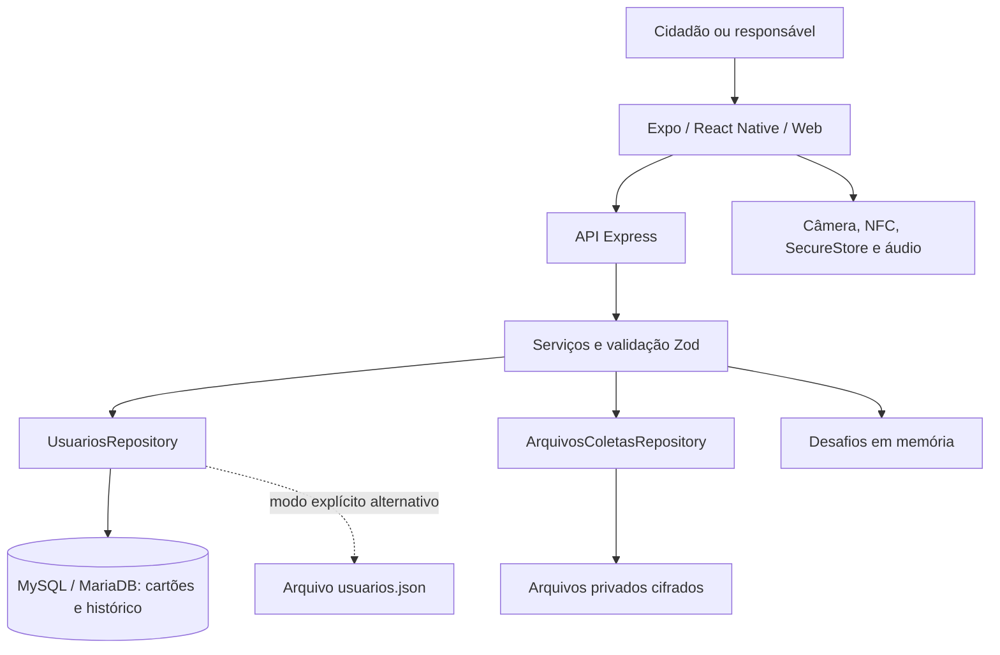
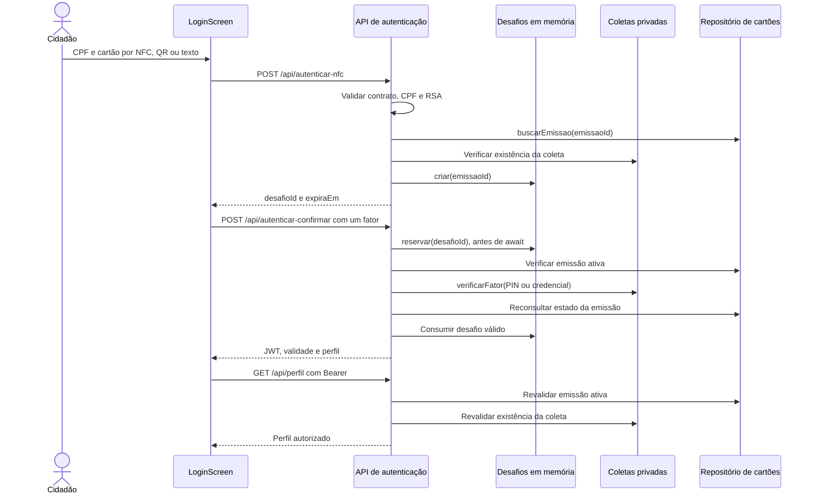
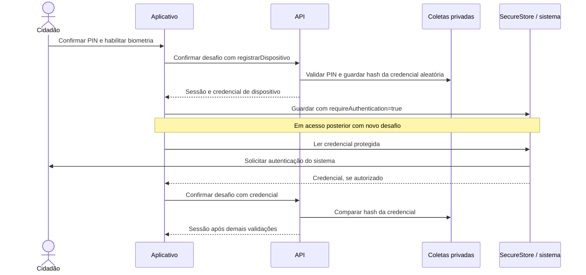

# Arquitetura do FácilID

[Índice da documentação](README.md) · [Banco de dados](BANCO-DE-DADOS.md) · [API](API.md)

**Referência funcional:** `1a37bcfc0405eae475b5d2d7fe171431b6b57475`, de 26/09/2026. Este capítulo descreve o código existente; propostas de evolução não representam funcionalidades entregues.

## 1. Visão estrutural

O FácilID / AcessoSênior é um monorepo npm com aplicativo Expo/React Native e API Express. O mesmo frontend atende navegador e dispositivo móvel, usando implementações específicas de plataforma para biometria, NFC e feedback. O backend concentra emissão, assinatura do cartão, autenticação e revogação.



O padrão do **servidor** é MySQL. O modo JSON é uma alternativa explícita, sobretudo útil aos testes; não existe sincronização nem troca automática para JSON em caso de falha do banco. O sistema exige **uma instância do backend**, porque coletas mantêm índice local em memória e desafios não são compartilhados entre processos.

## 2. Entradas e composição

| Entrada | Responsabilidade |
| --- | --- |
| [mobile/index.ts](../mobile/index.ts) → [mobile/App.tsx](../mobile/App.tsx) | Registra o aplicativo e controla login, área do responsável, sessão e endereço da API. |
| [backend/src/server.ts](../backend/src/server.ts) | Carrega ambiente, abre persistência, prepara segredos privados, inicia HTTP e encerra o pool ao receber sinal de parada. |
| [backend/src/app.ts](../backend/src/app.ts) → `createApp()` | Compõe middlewares, serviços, repositório de coletas, rotas, Swagger e erros. Não abre porta. |
| [backend/src/db/cli.ts](../backend/src/db/cli.ts) | Executa preparo, verificação ou importação do banco. |
| [backend/src/db/seed.ts](../backend/src/db/seed.ts) | Prepara recursos locais; exemplos com PIN dependem de configuração explícita. |

`createApp(dataDir, secret, adminToken?, options?)` recebe `options.repo` e `options.verificarPersistencia`. Sem repositório injetado usa `JsonUsuariosRepository`; isso permite testes isolados. `server.ts` injeta o adaptador escolhido por `abrirPersistencia()`.

## 3. Responsabilidades por camada

| Camada e arquivos | Símbolos e contratos centrais | Dependências e consumidores |
| --- | --- | --- |
| Telas: [LoginScreen.tsx](../mobile/src/screens/LoginScreen.tsx), [EmissorScreen.tsx](../mobile/src/screens/EmissorScreen.tsx), [SucessoScreen.tsx](../mobile/src/screens/SucessoScreen.tsx) | Entrada e confirmação; emissão/gestão; perfil e saída. | Usam API, componentes acessíveis e operações canceláveis; compostas por `App`. |
| Transporte: [api.service.ts](../mobile/src/services/api.service.ts) | `criarApi()` expõe `foto`, `emitir`, `usuarios`, `cartao`, `bloquear`, `entrar`, `confirmar`, `perfil`. | Axios, timeout e `AbortSignal`; separa credencial administrativa de JWT. |
| Contrato cliente: [identidade.ts](../mobile/src/services/identidade.ts) | `Chip`, `Sessao`, `DadosEmissao`, `lerIdentidade()`, `normalizarCpf()`. | Unifica leitura NFC, QR e texto; deve acompanhar schemas do backend. |
| Controle de operação: [useOperacao.ts](../mobile/src/components/useOperacao.ts) | `iniciar()`, `vigente()`, `cancelar()`. | Aborta transporte e invalida respostas tardias nas telas. |
| Rotas: [emissao.routes.ts](../backend/src/routes/emissao.routes.ts), [autenticacao.routes.ts](../backend/src/routes/autenticacao.routes.ts) | `emissaoRoutes()`, `autenticacaoRoutes()`. | Validam pedidos, coordenam serviços e traduzem resultados HTTP. |
| Validação: [payload.ts](../backend/src/schemas/payload.ts), [coleta.ts](../backend/src/schemas/coleta.ts) | `chipSchema`, `loginSchema`, `emissaoSchema`, `fotoSchema`, `confirmacaoSchema`, `desenhoSchema`. | Schemas Zod estritos; usados por rotas, repositórios e migração. |
| Emissão: [emissao.service.ts](../backend/src/services/emissao.service.ts) | `emitirPessoa()` recebe dados, assinatura e repositórios; devolve `Promise<Chip>`. | Gera UUID, coleta, assina e persiste; compensa falha removendo a coleta da tentativa. |
| Assinatura: [assinatura.service.ts](../backend/src/services/assinatura.service.ts) | `canonicalizar()`, `carregarChaves()`, `assinaturaService().assinar()/validar()`. | RSA-2048/SHA-256; consumido pela emissão e validação do cartão. |
| Persistência de cartões: [usuarios.repository.ts](../backend/src/repositories/usuarios.repository.ts), [mysql-usuarios.repository.ts](../backend/src/repositories/mysql-usuarios.repository.ts) | `UsuariosRepository`: `listar`, `buscar`, `buscarEmissao`, `salvar`, `bloquear`; retorno `Awaitable<T>`. | Implementações JSON/MySQL; todos os consumidores devem usar `await`. |
| Coletas: [coletas.repository.ts](../backend/src/repositories/coletas.repository.ts) | `ArquivosColetasRepository`: foto temporária, coleta, metadados, fatores e limites. | Arquivos AES-256-GCM; usado na emissão, confirmação e sessão. |
| Autenticação: [desafio.service.ts](../backend/src/services/desafio.service.ts), [auth.service.ts](../backend/src/services/auth.service.ts), [sessao.ts](../backend/src/middleware/sessao.ts) | Reserva de desafio; emissão/validação JWT; `exigirSessao()`. | Consulta cartão ativo e coleta; protege `/api/perfil` e futuras operações do cidadão. |

## 4. Fluxo de emissão e segunda via

```mermaid
sequenceDiagram
  actor R as Responsável
  participant E as EmissorScreen
  participant A as API de emissão
  participant C as Coletas privadas
  participant S as Assinatura RSA
  participant B as Repositório SQL
  R->>E: Autorizar administração e preencher cadastro
  opt Modo real
    E->>A: POST /api/emissao/foto
    A->>C: guardarFoto(bytes, mimeType)
    C-->>E: fotoId e hash, via API
  end
  E->>A: POST /api/emissao: desenho, PIN e dados
  A->>C: criar(emissaoId, coleta)
  C-->>A: Hashes e metadados
  A->>S: assinar(identidade v2)
  S-->>A: Chip
  A->>B: salvar(chip), com transação
  alt Persistência concluída
    B-->>A: Cartão ativo; anteriores substituídos
    A-->>E: 201 Chip
  else Falha de persistência ou assinatura
    A->>C: remover(emissaoId) da tentativa
    A-->>E: Erro sem detalhes internos
  end
```

No modo de demonstração a foto é fictícia, gerada internamente; desenho e PIN continuam no fluxo. No modo real são exigidos `fotoId` e confirmação de consentimento. A assinatura manuscrita é produzida a partir de coordenadas, e não de SVG arbitrário enviado pelo cliente.

A segunda via é uma nova emissão com UUID novo. A transação marca todos os cartões anteriores do CPF como `substituido` e insere o novo como `ativo`. O banco mantém o histórico. A revogação é consultada nos próximos acessos; não há push para encerrar instantaneamente a tela aberta.

## 5. Fluxo de autenticação e sessão



O primeiro pedido **não cria sessão**. A reserva impede duas confirmações simultâneas do mesmo desafio; erro recuperável libera a reserva e sucesso, expiração ou revogação invalidam a tentativa. O desafio dura dois minutos; há no máximo cinco por cartão e mil no processo.

O JWT usa HS256, `sub=cpf`, `emissaoId`, emissor `facilid`, audiência `acessosenior` e validade de quinze minutos. A assinatura do JWT não dispensa consulta de revogação. Falha do banco segue como erro de infraestrutura, não como credencial inválida. Contratos HTTP completos: [API](API.md).

## 6. Biometria do aparelho



[biometria.service.ts](../mobile/src/services/biometria.service.ts) usa LocalAuthentication para disponibilidade e SecureStore para proteger o segredo. A chave de armazenamento é vinculada à URL da API e ao `emissaoId`. O servidor recebe uma credencial verificável, nunca aceita apenas um booleano de “biometria confirmada”. Cancelamento, falha ou plataforma web permitem usar PIN.

Essa integração não coleta impressão digital nem reconhece a pessoa pela foto cadastrada. O sistema operacional decide a autenticação local; um aparelho compartilhado não comprova vínculo entre CPF e biometria. Veja [Segurança e privacidade](SEGURANCA-E-PRIVACIDADE.md).

## 7. Fronteiras de estado e dados

| Local | Conteúdo | Vida útil / implicação |
| --- | --- | --- |
| Memória do aplicativo | Tela, URL ajustada, cartão preparado e sessão. | Reinício perde esse estado. Sair remove sessão e cartão preparado. |
| SecureStore nativo | Credencial aleatória protegida por autenticação local. | Persistência vinculada ao aparelho, servidor e emissão. |
| MySQL/MariaDB | Identidade assinada, estado, histórico e migrações. | Não contém foto, desenho completo, PIN ou segredo do aparelho. Dados de identidade não são cifrados pela aplicação no SQL. |
| Diretório privado `DATA_DIR` | Chaves RSA/JWT/admin e arquivos de coleta. | Deve ser preservado e protegido junto ao banco. Caminho padrão: `backend/.local/`. |
| Arquivos de coleta | Foto, SVG e índice cifrados; índice contém hashes/salts do PIN, hashes de dispositivos e limites de tentativas. | AES-256-GCM; chave local separada dos arquivos, na mesma pasta privada. |
| Memória do backend | Desafios e índice de coletas carregado. | Reinício exige reler cartão para obter desafio; impede distribuição entre várias instâncias. |

Não há transação distribuída entre SQL e arquivos. A compensação cobre falhas tratadas na emissão, mas uma interrupção abrupta pode deixar estados que exigem diagnóstico. O backup coerente inclui banco, diretório privado e configuração, com a API parada.

## 8. Decisões a preservar ao evoluir

- **Contrato do cartão:** `Chip` v2 inclui campos assinados e UUID; estado é externo à assinatura. Alterar ordem/campos da canonicalização ou chaves invalida compatibilidade com cartões emitidos.
- **Separação de fatores:** cartão assinado continua copiável; PIN ou credencial do dispositivo complementam a verificação. Hash da foto e desenho não provam identidade civil ou autoria.
- **Persistência explícita:** `db:setup` prepara schema; início da API apenas o verifica. `validarSchema()` confere colunas consultáveis, não audita todos os índices, tipos e privilégios.
- **Contrato entre camadas:** atualizar schemas, rotas, cliente e [swagger.ts](../backend/src/docs/swagger.ts) conjuntamente. OpenAPI é mantido manualmente.
- **Plataformas:** os arquivos `.web.ts` fornecem comportamento compatível com navegador. Expo Dev Client é necessário para validar o conjunto nativo; a configuração atual desativa a nova arquitetura por compatibilidade com NFC.
- **Simplicidade de interface:** navegação está em `App.tsx`, sem roteador adicional. Elementos compartilhados ficam em [Ui.tsx](../mobile/src/components/Ui.tsx) e [theme/index.ts](../mobile/src/theme/index.ts).
- **Expansões futuras:** novas rotas do cidadão devem usar `exigirSessao()`. Serviços municipais, pagamentos, filas externas e reconhecimento facial não fazem parte da arquitetura implementada.

Para alterar concorrência, migração, canonicalização, cifra ou cancelamento, leia diretamente os arquivos indicados. Esta documentação orienta a localização, sem substituir revisão da implementação sensível.
