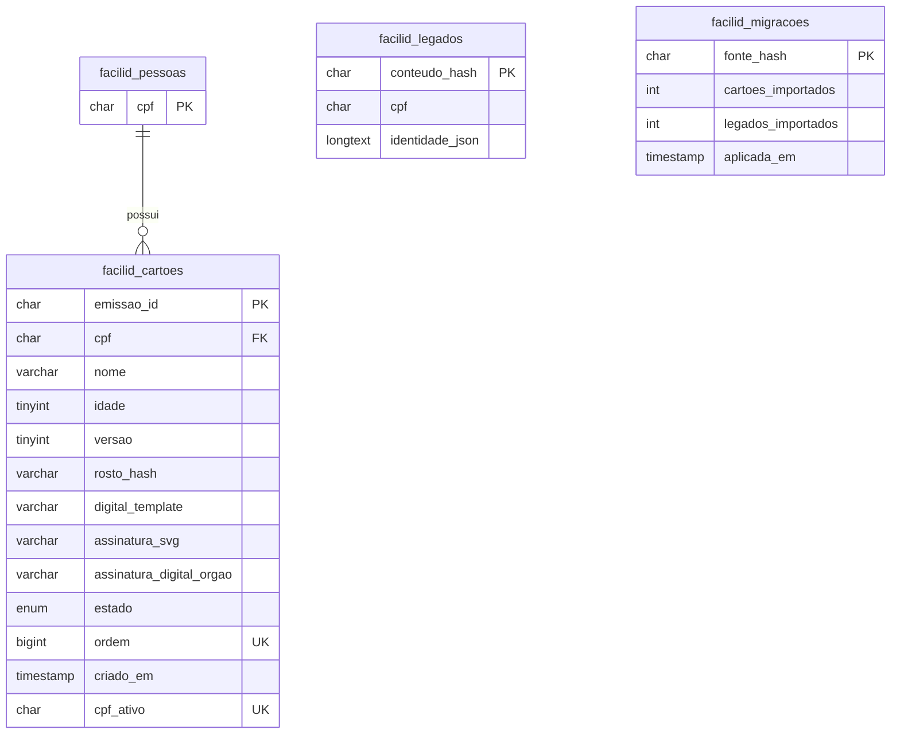

# Banco de dados e persistência

[Índice da documentação](README.md) · [Arquitetura](ARQUITETURA.md) · [Operação e manutenção](OPERACAO-E-MANUTENCAO.md)

**Referência funcional:** `1a37bcfc0405eae475b5d2d7fe171431b6b57475`, de 26/09/2026. A integração foi validada anteriormente com MariaDB 10.4.32 do XAMPP; isso não equivale a execução em MySQL 8. As tabelas e comportamentos abaixo foram conferidos no código-fonte.

## 1. Escopo da persistência

O banco padrão chama-se `facilid`, configurável por `DB_NAME`. Guarda cartões assinados, estados, registros legados e controle de importação. Fotos, SVG completo, hashes de PIN e de credenciais de dispositivo permanecem em arquivos privados cifrados. Não existem tabelas de administradores, agendamentos ou serviços municipais.

| Fonte | Papel |
| --- | --- |
| [backend/src/db/mysql.ts](../backend/src/db/mysql.ts) | Configuração do driver mysql2, criação explícita, `MYSQL_SCHEMA`, `prepararSchema()` e `validarSchema()`. |
| [backend/src/db/schema-mysql.sql](../backend/src/db/schema-mysql.sql) | Espelho legível do DDL; teste de equivalência evita divergência em relação ao código. |
| [backend/src/repositories/mysql-usuarios.repository.ts](../backend/src/repositories/mysql-usuarios.repository.ts) | Consultas parametrizadas, conversão/validação de registros e transações. |
| [backend/src/db/migrar-json.ts](../backend/src/db/migrar-json.ts) | Importação explícita e transacional do arquivo local. |
| [backend/src/db/persistencia.ts](../backend/src/db/persistencia.ts) | Seleção de adaptador, verificação de conexão e fechamento do pool. |
| [backend/src/repositories/coletas.repository.ts](../backend/src/repositories/coletas.repository.ts) | Persistência privada de mídia, fatores e limites fora do SQL. |

Todas as tabelas usam **InnoDB**, `utf8mb4` e collation padrão `utf8mb4_unicode_ci`. Identificadores e assinaturas usam comparações binárias especificadas nas colunas. Todos os campos de entrada listados abaixo são `NOT NULL`; `cpf_ativo` é derivado e pode resultar em `NULL`.

## 2. Relacionamentos

O único relacionamento imposto por chave estrangeira é `facilid_cartoes.cpf → facilid_pessoas.cpf`. `facilid_legados` e `facilid_migracoes` são tabelas independentes; sem linha de relacionamento no diagrama. `emissao_id` também associa logicamente o cartão à coleta privada, sem uma FK entre SQL e arquivos.

## 3. Dicionário de dados

### `facilid_pessoas`

| Coluna | Tipo | Regra e significado |
| --- | --- | --- |
| `cpf` | `CHAR(11)` ASCII, `ascii_bin` | Chave primária. Linha estável usada para serializar operações da mesma pessoa; não é cadastro completo separado. |

### `facilid_cartoes`

| Coluna | Tipo | Regra e significado |
| --- | --- | --- |
| `emissao_id` | `CHAR(36)` ASCII, `ascii_bin` | Chave primária; UUID da emissão. No contrato da API chama-se `emissaoId`. |
| `cpf` | `CHAR(11)` ASCII, `ascii_bin` | FK para pessoa; conserva zeros à esquerda. A aplicação valida onze dígitos, sem dígitos verificadores. |
| `nome` | `VARCHAR(100)` | Nome do titular no momento da emissão; aplicação exige 2–100 caracteres após trim. |
| `idade` | `TINYINT UNSIGNED` | Idade informada na emissão; `CHECK idade <= 130`. Não é calculada a partir de data de nascimento. |
| `versao` | `TINYINT UNSIGNED` | Versão do formato; `CHECK versao = 2`. |
| `rosto_hash` | `VARCHAR(128)`, `utf8mb4_bin` | SHA-256 dos bytes da foto, real ou de demonstração. Não é reconhecimento facial. |
| `digital_template` | `VARCHAR(128)`, `utf8mb4_bin` | Marcador `BIOMETRIA_LOCAL_NAO_COLETADA` ou `DEMONSTRACAO_SEM_BIOMETRIA`; não contém template de digital. |
| `assinatura_svg` | `VARCHAR(300)`, `utf8mb4_bin` | Referência `sha256:<hash>` do desenho; não contém SVG completo. |
| `assinatura_digital_orgao` | `VARCHAR(1024)` ASCII, `ascii_bin` | Assinatura RSA/SHA-256 da identidade canonicalizada, codificada em base64. |
| `estado` | `ENUM('ativo','bloqueado','substituido')` | Estado operacional fora da identidade assinada. |
| `ordem` | `BIGINT UNSIGNED AUTO_INCREMENT` | Sequência única usada para ordenação; índice `facilid_ordem`. Não equivale a posição sem lacunas. |
| `criado_em` | `TIMESTAMP(3)` | Inserção no SQL, padrão `CURRENT_TIMESTAMP(3)`. Na importação indica o momento da inserção, não necessariamente a emissão original. |
| `cpf_ativo` | `CHAR(11)` ASCII, `ascii_bin`, gerada `STORED` | Igual ao CPF somente quando `estado='ativo'`; `NULL` nos demais estados. Não deve ser preenchida manualmente. |

Índices e restrições: PK `emissao_id`; UNIQUE `facilid_ordem(ordem)`; UNIQUE `facilid_um_cartao_ativo(cpf_ativo)`; índice `facilid_cartoes_cpf(cpf)`; FK `facilid_cartoes_pessoa`; checks `facilid_idade_valida` e `facilid_versao_valida`. O UNIQUE da coluna gerada permite múltiplos cartões inativos e **no máximo um ativo por CPF**. A FK não declara cascata de exclusão.

### `facilid_legados`

| Coluna | Tipo | Regra e significado |
| --- | --- | --- |
| `conteudo_hash` | `CHAR(64)` ASCII, `ascii_bin` | PK; SHA-256 da identidade normalizada, separador e número da ocorrência na origem. Preserva repetições legítimas sem duplicar reimportação. |
| `cpf` | `CHAR(11)` ASCII, `ascii_bin` | CPF histórico, com índice `facilid_legados_cpf`; sem FK para pessoas. |
| `identidade_json` | `LONGTEXT`, `utf8mb4_bin` | Identidade v1 preservada como JSON; check `facilid_legado_json_valido` usa `JSON_VALID`. |

Legados não são retornados como cartões ativos nem autenticam usuários. Precisam de nova emissão com assinatura manuscrita e PIN. Preservar o histórico não cria fatores de autenticação automaticamente.

### `facilid_migracoes`

| Coluna | Tipo | Regra e significado |
| --- | --- | --- |
| `fonte_hash` | `CHAR(64)` ASCII, `ascii_bin` | PK; SHA-256 dos bytes originais do arquivo importado. |
| `cartoes_importados` | `INT UNSIGNED` | Quantidade de cartões inseridos naquela execução inicial registrada. |
| `legados_importados` | `INT UNSIGNED` | Quantidade de legados inseridos naquela execução inicial registrada. |
| `aplicada_em` | `TIMESTAMP(3)` | Data da gravação do marcador, padrão `CURRENT_TIMESTAMP(3)`. |

Essa tabela controla importação de dados; não constitui ferramenta geral de versionamento de schema. Alterações futuras de DDL exigirão uma estratégia explícita de evolução.

## 4. Consultas, transações e concorrência

`MysqlUsuariosRepository` implementa `UsuariosRepository`. `listar()` devolve resumos em ordem de inserção; `buscar(cpf)` busca somente o ativo; `buscarEmissao(emissaoId)` devolve chip e estado. Dados vindos do banco são convertidos e validados por Zod. Valores de usuário entram por parâmetros; múltiplas instruções SQL estão desativadas no driver.

**Emissão/segunda via — `salvar(chip)`:** abre transação, faz UPSERT da linha de pessoa, marca cartões anteriores como `substituido`, insere o novo ativo e confirma. O UPSERT adquire lock exclusivo por CPF inclusive para pessoa já existente. A versão anterior com `INSERT IGNORE` e promoção posterior de lock causava disputa em emissões concorrentes; não restaurar esse padrão na emissão. O índice UNIQUE acrescenta proteção à regra de um ativo. Falha executa rollback e libera a conexão.

**Bloqueio — `bloquear(emissaoId)`:** localiza o CPF, bloqueia pessoa e cartão nessa ordem, muda `ativo` para `bloqueado` e confirma. Cartões já substituídos permanecem substituídos; emissão inexistente retorna `undefined`. A mesma ordem de locks da emissão reduz conflitos.

Essas transações protegem somente o SQL. `emitirPessoa()` grava a coleta privada antes do cartão e tenta removê-la se a emissão falhar. Não há commit atômico envolvendo banco e arquivos, nem suporte a várias instâncias com esse armazenamento privado.

## 5. Preparo, conexão e validação

- `npm run db:setup`: cria banco e tabelas explicitamente, caso ausentes. Não equivale a `ALTER TABLE` para corrigir schema já divergente.
- `npm run db:check`: verifica conexão e presença das colunas consultadas, sem ler identidades. Não audita todos os tipos, índices, constraints ou privilégios.
- `npm run db:migrate`: importa o arquivo `usuarios.json` do `DATA_DIR` configurado; com origem ausente informa que não há dados a importar.
- O servidor valida schema ao iniciar; não cria banco e não faz fallback para outro adaptador. O health check MySQL executa `SELECT 1`, e não uma auditoria de integridade completa.

O pool usa até cinco conexões, fila de cem solicitações, timeout de conexão de dez segundos e configuração `timezone: 'Z'`. `DB_NAME` aceita até 64 caracteres alfanuméricos/sublinhado, começando por letra, antes de ser usado como identificador DDL. Os parâmetros e permissões locais estão em [Instalação e configuração](INSTALACAO-E-CONFIGURACAO.md); não grave valores privados na documentação.

## 6. Migração de JSON para SQL

Execute com a API parada e após backup. A função `migrarJson(file, pool)` lê a origem sem instanciar `JsonUsuariosRepository`; assim evita a conversão automática de v1 feita pelo construtor desse adaptador. **Não modifica, renomeia, reassina nem apaga a origem ou suas chaves.**

1. Lê os bytes e valida JSON v1 (array de identidades antigas) ou envelope v2 `{versao, cartoes, legados}`. Rejeita UUIDs repetidos e mais de um cartão ativo para o mesmo CPF na origem.
2. Calcula IDs estáveis para legados, incluindo a ocorrência para preservar duplicatas originais.
3. Obtém lock nomeado do banco com `GET_LOCK`, aguardando até dez segundos; abre transação e bloqueia as linhas consultadas.
4. Compara registros existentes com a origem. Cartão ou legado extra, conteúdo diferente ou estado alterado gera conflito; não sobrescreve destino divergente.
5. Insere somente registros ausentes, preservando IDs, assinaturas e estados. Não valida novamente a assinatura RSA nessa etapa; a autenticação continua responsável por verificá-la com a chave original.
6. Registra hash dos bytes e contagens, faz commit e libera lock/conexão. Falha causa rollback.

Retorno: `{cartoesImportados, legadosImportados, jaAplicada}`. Reexecutar o mesmo arquivo sobre a mesma base consistente retorna zero importações e `jaAplicada: true`. Se há marcador de importação mas registros foram removidos, a migração recusa recriá-los. Alterações posteriores no destino, como bloqueios e novas emissões, podem tornar uma reexecução conflitante; esse comando não é sincronização recorrente.

Erros controlados: `FACILID_MIGRATION_INVALID` (origem inválida/inconsistente) e `FACILID_MIGRATION_CONFLICT` (destino divergente ou migração concorrente). O CLI apresenta mensagens sanitizadas. Corrigir conflito exige analisar fonte e destino preservados; não limpar tabelas para forçar o comando.

No registro histórico da entrega de 26/09/2026, quatro identidades v1 foram preservadas como legados. Essa é uma evidência da entrega, não uma contagem atual consultada para este documento. Cartão v2 importado sem coleta privada correspondente também exige reemissão para autenticar.

## 7. Backup, restauração e limites

O conjunto recuperável é **dump do banco + todo o `DATA_DIR` + configuração privada correspondente**. Inclui chaves RSA, chave de coleta, índice e arquivos de mídia, além dos segredos necessários à continuidade. A API deve permanecer parada durante a obtenção desse conjunto para evitar snapshots de momentos diferentes; proteja o backup como material sensível.

A restauração deve recuperar o conjunto coerente antes da inicialização. Banco sem coletas impede confirmação; coletas sem chave AES não podem ser decifradas; troca do par RSA rompe validação de cartões antigos. Não gere novas chaves para contornar uma restauração incompleta. Detalhes operacionais: [Operação e manutenção](OPERACAO-E-MANUTENCAO.md).

O banco contém identidade em texto legível, apesar de mídia/fatores estarem cifrados fora dele. A chave AES fica na mesma pasta privada dos arquivos; acesso integral à pasta compromete essa proteção. Não há rotina automática de retenção, exclusão por titular, auditoria completa ou backup agendado.

## 8. Evidência e manutenção do contrato

[mysql-config.test.ts](../backend/tests/mysql-config.test.ts) verifica configuração e equivalência do schema. [mysql.integration.mysql.ts](../backend/tests/mysql.integration.mysql.ts) cobre persistência, concorrência, bloqueio, rollback e migração em bancos artificiais isolados. `npm run test:mysql` é optativo e não usa o banco principal como massa; consulte [Testes e qualidade](TESTES-E-QUALIDADE.md).

Ao alterar uma coluna ou regra, revise conjuntamente DDL em `mysql.ts`/`schema-mysql.sql`, mapeamento do repositório, schemas Zod, migração e testes. Preserve o contrato JSON e suas assinaturas quando a alteração afetar apenas persistência.
